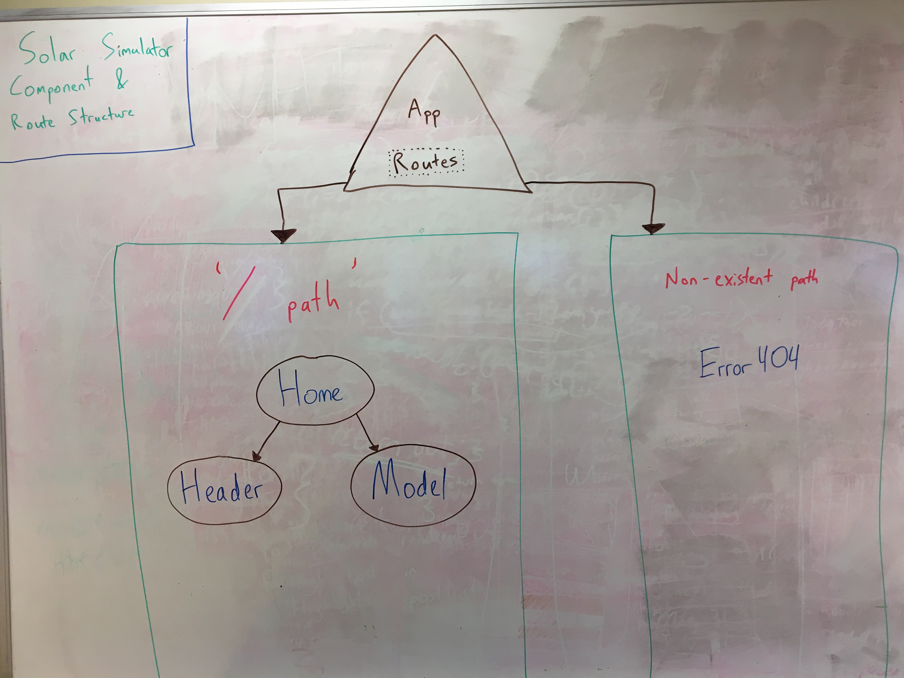

# Solar Simulator

#### By **Ian Cook Westgate**, **Travis Toal**, **Ryan McLean**, **Robbie Kruszynski** and **Slater Smith**

## Description

The Solar Simulator is designed with two goals in mind. First, use the three.js Javascript 3D library to depict a visually stunning and responsive reproduction of the solar system. Second, utilize the International Space Station's (ISS) API to give an approximate portrayal of its current location in orbit around Earth.

## Component Structure    

## Landing Page

## User Stories

* As a science teacher, I would love a spectacular and dynamic website that my students can use to learn more about the planets of the solar system.
* As a programmer looking for new tech to use and learn from, I want the website to show the power of three.js across more than one object.
* As a potential investor, I am looking for a website that can harness both visual excitement in the user as well as provide a learning experience.

## Setup

* In your terminal, if you intend to view the code and want to make the React pages more legible, enter `apm install react`.
* Using your terminal, clone this repo by inputting `git clone https://github.com/travisty12/solar-simulator.git`.
* Navigate to the folder in the terminal by typing in: `cd solar-simulator`.
* In your terminal, enter `npm install` to install necessary dependencies.
* Then enter `npm run start` to view the project, which will be opened in a new browser tab.

## Site Features

* The solar system (not to scale) is visually depicted on the screen. This includes all planets, the sun, and Earth's moon.
* The user can use their mousewheel along with click and drag on the screen in order to change the visual direction. This is currently locked to Earth's position.
* The user can view the ISS's approximate position in orbit around Earth, updated every 5 seconds from NASA's API.
* The user can select the different planets in the upper-left header menu in order to view some educational information about each one.

## Future Features

* Permit the user to move the camera around all of the solar system, not just Earth.
* The camera should zoom to each planet that the user selects in the header menu.
* Zooming into the ISS's position should let the user view a picture of what the interior of the ISS looks like to the astronauts who use it.

## Technologies Used

* HTML
* CSS
* JavaScript
  * three.js
* Node Packet Manager (NPM)
* Babel
* Webpack
* React
* ESLint

## Known Bugs

*

## Support and contact details

_Email iancookwestgate@gmail.com with any questions._

## License

This software is licensed under the MIT license.

Copyright (c) 2019 **Ian Cook Westgate**, **Travis Toal**, **Ryan McLean**, **Robbie Kruszynski** and **Slater Smith**
